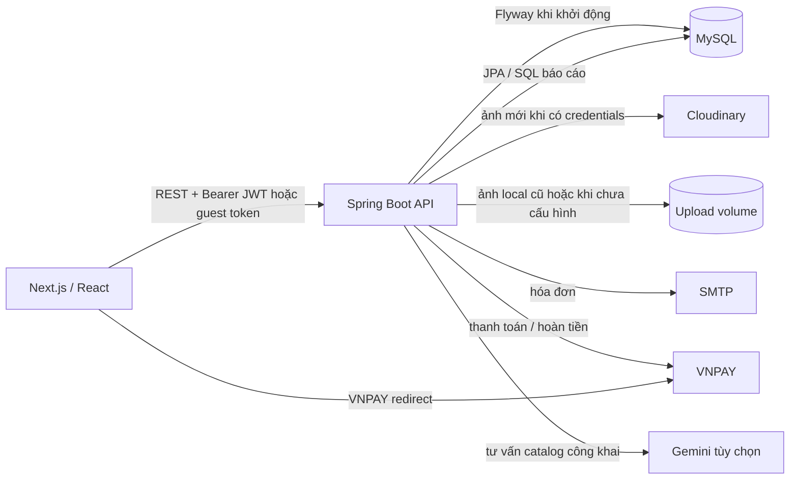

# GreenFarm — bối cảnh dự án

> Ảnh chụp kiến trúc ngày 06/10/2026, dựa trên **workspace hiện tại** (kể cả các file chưa commit). Đây là bản đồ để phát triển tiếp, không thay thế hợp đồng chi tiết trong `docs/api/` hoặc mã nguồn. Một số đoạn của `README.md` và tài liệu giai đoạn cũ chưa được cập nhật theo module kho V22; khi có khác biệt, đối chiếu code, migration và API hiện tại.

## 1. Tổng quan kiến trúc

GreenFarm là ứng dụng thương mại điện tử nông sản. Frontend Next.js gọi REST API của backend Spring Boot; backend xác thực, thực thi quy tắc nghiệp vụ và lưu vào MySQL. MySQL khởi tạo từ dump cũ rồi được Flyway nâng cấp. Ảnh tải lên dùng thư mục/volume riêng. VNPAY, SMTP và Gemini là tích hợp tùy cấu hình.



| Thành phần | Công nghệ và vai trò |
| --- | --- |
| Frontend | Next.js `16.3.3` App Router, React `19.2.4`, TypeScript, CSS toàn cục/Tailwind 4, Axios, Zustand, Lucide. Trang trong `src/app`, màn hình tương tác trong `src/components`, lời gọi API trong `src/services`. |
| Backend | Java 21, Spring Boot `4.1.0` (Web MVC, Security, Validation, Data JPA, Mail), Maven, JWT qua JJWT, springdoc/OpenAPI, scheduler. |
| Dữ liệu | MySQL `8.0.44`; Hibernate `ddl-auto: none`; Flyway baseline phiên bản 1 và migration V2–V23. |
| Chạy local | Docker Compose chạy `mysql` và `backend`; frontend chạy riêng bằng `npm run dev`. Backend thường ở `localhost:8080`, frontend `localhost:3000`, MySQL host `localhost:3307`. |
| Đóng gói | `Dockerfile` build JAR bằng Maven (`mvn package`, có chạy test) rồi dùng JRE 21; `compose.yml` lưu MySQL và ảnh local cũ bằng named volume. Ảnh mới dùng Cloudinary khi cấu hình đủ credentials; `railway.json` dành cho triển khai backend trên Railway. |

## 2. Cấu trúc thư mục

```text
GreenFarm/
├── frontend/
│   ├── src/app/             # Route, layout, metadata và globals.css
│   ├── src/components/      # UI theo miền: admin, auth, catalog, order, ...
│   ├── src/services/        # Lời gọi API
│   ├── src/types/           # TypeScript type/DTO phía client
│   ├── src/stores/          # Zustand auth store
│   ├── src/lib/             # Axios client, format, guest session, xử lý lỗi
│   └── public/              # Tài nguyên tĩnh
├── backend/
│   ├── src/main/java/com/agri/ecommerce/
│   │   ├── controller/      # auth, publicapi, customer, staff, delivery, admin
│   │   ├── service/         # Quy tắc nghiệp vụ và giao dịch
│   │   ├── repository/      # Spring Data JPA, truy vấn báo cáo
│   │   ├── entity/          # JPA entity, enum/converter
│   │   ├── dto/             # Request/response DTO
│   │   ├── security/        # JWT filter, principal, xử lý 401/403
│   │   ├── config/          # Security, CORS, upload
│   │   ├── scheduler/       # Hết hạn thanh toán, email, lô kho
│   │   └── common/          # Response và exception chung
│   ├── src/main/resources/  # application.yml và db/migration/
│   └── src/test/            # Unit test và một số integration test
├── database/local/          # Dump baseline lịch sử, không commit vào Git
├── docs/api/                # Hợp đồng và quy tắc từng module
├── compose.yml              # MySQL + backend local
├── Dockerfile               # Build/deploy backend
└── railway.json             # Cấu hình deploy backend Railway
```

### Frontend

- `src/app` khai báo các URL. Page thường mỏng, giao phần tương tác cho client component. `layout.tsx` bọc toàn ứng dụng bằng `CommerceProvider` và gắn `ChatWidget`.
- `src/services/*-service.ts` gọi backend qua `src/lib/axios-client.ts`. Base URL mặc định là `http://localhost:8080/api`, có thể đổi bằng `NEXT_PUBLIC_API_BASE_URL`. Axios tự gắn access token và thử refresh một lần khi gặp 401.
- `src/stores/auth-store.ts` dùng Zustand persist vào `localStorage` (`greenfarm-auth`) cho access token, refresh token và user. `RoleGuard` chuyển hướng theo role để điều hướng UI; **backend vẫn là nơi quyết định quyền truy cập**.
- `CommerceProvider` chọn giỏ hàng tài khoản hoặc giỏ khách, đồng bộ lại khi cửa sổ được focus. `src/lib/guest-session.ts` giữ guest token, khóa checkout và tối đa 10 mã tra cứu đơn trên thiết bị. Không đưa lookup token vào URL.
- Cổng đăng nhập riêng: `/login`, `/staff/login`, `/delivery/login`, `/admin/login`. Các khu vực tương ứng là storefront/customer, `/staff`, `/delivery`, `/admin`.
- Route tiêu biểu: `/products`, `/categories/[slug]`, `/cart`, `/wishlist`, `/checkout`, `/orders`, `/orders/[id]`, `/orders/[id]/invoice`, `/guest-orders`, `/guest-orders/[id]/invoice`, `/points`, `/contact`, `/profile`; admin có `/admin/users`, `/admin/categories`, `/admin/products`, `/admin/inventory`, `/admin/orders`, `/admin/coupons`, `/admin/contacts`. `/admin` là dashboard báo cáo.

### Backend

Luồng thông thường: `Controller` nhận/kiểm tra DTO → `Service` chạy quy tắc và transaction → `Repository` truy cập entity/MySQL → trả DTO qua `ApiResponse`. `GlobalExceptionHandler` đổi lỗi thành JSON có `status`, `code`, `message`, `path` và `fieldErrors`. API phân trang trả `PageResponse` (`content`, `page`, `size`, `totalElements`, `totalPages`, `first`, `last`).

Các service quan trọng liên kết nhiều module: `OrderService`/`GuestCommerceService` tạo đơn; `OrderLifecycleService` quản lý chuyển trạng thái; `InventoryService` giữ/xuất/hoàn lô; `CouponEngineService` giữ và tiêu thụ lượt coupon; `LoyaltyService` đổi/cộng/hoàn điểm; `PaymentService`/`VnpayRefundService` xử lý tiền; `NotificationService` và `InvoiceEmailService` phát thông báo/hóa đơn. `BusinessReportService` đọc số liệu tổng hợp từ `BusinessReportRepository`.

## 3. Authentication và phân quyền

- Đăng ký tạo tài khoản `customer`; mật khẩu lưu bằng BCrypt. Đăng nhập có thể ràng buộc `role` với cổng đăng nhập; 5 lần sai mặc định khóa 15 phút (cấu hình được).
- Access token JWT ký bằng secret backend, mặc định hết hạn sau 24 giờ. Refresh token ngẫu nhiên tồn tại mặc định 30 ngày, **chỉ hash SHA-256 được lưu ở MySQL**; refresh xoay vòng, dùng lại token cũ làm thu hồi phiên. Logout thu hồi token, đổi mật khẩu thu hồi tất cả refresh token của tài khoản.
- `JwtAuthenticationFilter` đọc `Authorization: Bearer ...`, tải user hiện tại và kiểm tra trạng thái/khóa tài khoản. `GreenFarmUserDetails` tạo `ROLE_*` và authority từ `role_permissions`. Backend dùng `SecurityFilterChain` cùng `@PreAuthorize`; API mặc định cần xác thực, ngoại lệ gồm auth công khai, `/api/public/**`, VNPAY callback, health, OpenAPI/Swagger và ảnh tải lên.
- Role baseline: `admin`, `staff`, `delivery_staff`, `customer`. Permission có `manage_users`, `manage_products`, `manage_orders`, `manage_categories`, `manage_contacts`, `manage_deliveries`; migration cấp thêm `manage_coupons` và quyền vận hành liên quan. Các API admin khác còn kiểm tra role `ADMIN` trực tiếp. Không xem việc ẩn nút hoặc `RoleGuard` là biện pháp bảo mật.
- Backend stateless, tắt CSRF cho REST, CORS giới hạn origin cấu hình bằng `APP_CORS_ALLOWED_ORIGINS`. Secret JWT, DB, SMTP, VNPAY, Gemini chỉ đặt trong môi trường backend/`.env`; không đưa vào `NEXT_PUBLIC_*` hoặc tài liệu.

## 4. Bản đồ API

Các path dưới đây có tiền tố `/api`. Chi tiết request/response nằm trong [`docs/api/`](docs/api/).

| Nhóm | Base path chính | Chức năng/quyền |
| --- | --- | --- |
| Công khai | `/health`, `/public/categories`, `/public/products`, `/public/products/{id}/reviews`, `/public/coupons`, `/public/contacts`, `/public/chat` | Kiểm tra dịch vụ, catalog/review/coupon công khai, liên hệ và chat; chat có thể nhận JWT tùy chọn để gắn lịch sử user. |
| Phiên khách | `/public/guest/sessions`, `/public/guest/cart`, `/public/guest/checkout/preview`, `/public/guest/orders` | Guest token qua `X-Guest-Token`, checkout idempotent, recovery và tra cứu bằng email + lookup token. |
| Xác thực/tài khoản | `/auth/*`, `/users/me`, `/roles`, `/admin/users` | Đăng ký, login, refresh, logout, hồ sơ/ảnh/mật khẩu; role và user admin cần `manage_users`. |
| Mua hàng | `/cart`, `/wishlist`, `/shipping-addresses`, `/checkout/preview`, `/orders`, `/payments`, `/loyalty`, `/reviews` | Các thao tác customer có JWT; VNPAY return/IPN là callback công khai. |
| Vận hành | `/staff/orders`, `/delivery/orders`, `/operations/contacts`, `/notifications` | Staff xử lý đơn/liên hệ; delivery nhận/giao đơn; thông báo có API danh sách và SSE `/notifications/stream`. |
| Quản trị | `/admin/categories`, `/admin/products`, `/admin/uploads`, `/admin/coupons`, `/admin/orders`, `/admin/refund-requests`, `/admin/inventory`, `/admin/suppliers`, `/admin/reports` | Catalog, voucher, đơn/hoàn tiền, kho, nhà cung cấp, báo cáo và CSV; kiểm tra role/permission ở backend. |

`GET /admin/orders` (tức `/api/admin/orders`) có `view=active|history|all`, `status`, `page`, `size`; API cũ không truyền `view` vẫn nhận `all`. Giao diện mặc định `active`, còn `history` chứa `completed`/`canceled`. Các đơn này **không bị xóa**. `GET /admin/reports` và `/admin/reports/export.csv` nhận khoảng ngày; dashboard có lựa chọn 7/30/90 ngày.

## 5. Database và quan hệ dữ liệu

Dump cũ ở `database/local/veggie-main.sql` là baseline V1 (không có file `V1__...sql`). Compose chỉ import dump khi tạo volume MySQL **lần đầu**; restart container không import lại. Flyway `baseline-on-migrate: true`, sau đó chạy các file V2–V23 trong `backend/src/main/resources/db/migration/`. `ddl-auto: none` nghĩa là JPA không tự sửa schema.

| Quan hệ chính | Ý nghĩa |
| --- | --- |
| `roles` ↔ `permissions` qua `role_permissions`; `users` → `roles` | RBAC. User còn có địa chỉ, giỏ, wishlist, review, thông báo, refresh token và sổ điểm. |
| `categories` → `products` → `product_images` | Catalog. Giỏ và wishlist nối user/guest với product. |
| `orders` → `order_items`, `order_status_history`, `payments` | Đơn lưu snapshot người nhận, tên/đơn vị/ảnh/giá sản phẩm và số tiền; lịch sử không phụ thuộc catalog đổi sau này. Order thuộc user **hoặc** `guest_sessions`, có thể gắn nhân viên giao, địa chỉ và hai loại coupon. |
| `coupons` → `coupon_usages`; `loyalty_point_transactions` → user/order/review | Giữ, sử dụng, trả lại lượt ưu đãi/điểm với lịch sử để tránh cộng trừ trùng. Coupon có thể giới hạn theo category/product. |
| `suppliers` → `inventory_batches` → `order_inventory_allocations`/`inventory_transactions` | Lô nhập, hạn dùng, phần đã giữ/xuất cho từng order item và sổ biến động kho. |
| `orders` → `refund_requests`; `payments` → `vnpay_refunds` | Yêu cầu của khách, quyết định admin và bản ghi giao dịch hoàn tiền gateway. |
| `guest_sessions` → `guest_cart_items`; `chat_messages` → user hoặc guest token hash | Phiên mua hàng khách và hội thoại; không lưu token thô trong DB. |

Các migration theo nhóm:

| Phiên bản | Thay đổi chính |
| --- | --- |
| V2–V4 | Bảo vệ đăng nhập, index catalog, ràng buộc giỏ/wishlist. |
| V5–V9 | Snapshot và constraint đơn hàng, metadata thanh toán, vòng đời đơn/coupon, quyền staff và giao hàng. |
| V10–V11 | Review/liên hệ/thông báo, mốc gửi hóa đơn. |
| V12–V14 | Điểm thưởng, chống trùng/hoàn điểm, coupon hai loại và bảng lượt dùng/scope. |
| V15–V19 | Refresh token, retry email, theo dõi/đối soát hoàn tiền VNPAY, yêu cầu hoàn tiền của khách. |
| V20–V21 | Lịch sử chatbot; phiên, giỏ và đơn khách vãng lai. |
| V22 | Nhà cung cấp, lô kho, phân bổ đơn, sổ giao dịch kho; chuyển tồn cũ sang lô `LEGACY-*` mà không đổi số tồn đang bán. |

## 6. Module và luồng nghiệp vụ

| Module | Đã triển khai và liên hệ với module khác |
| --- | --- |
| Catalog và nội dung | Danh mục, lọc/tìm/phân trang sản phẩm, ảnh tải lên, ẩn/hiện sản phẩm. Product là đầu vào của giỏ, voucher, review, báo cáo và kho. |
| Giỏ, wishlist, guest | Giỏ tài khoản và giỏ khách; gộp giỏ khi đăng nhập, kiểm tra lại tồn/giá. Guest checkout COD/VNPAY dùng khóa idempotency và mã tra cứu riêng; không tự tạo user. |
| Checkout, đơn và giao hàng | Backend tính lại giá, phí giao, coupon và điểm; tạo đơn/lưu snapshot trong transaction. Trạng thái: `pending → processing → ready_for_delivery → out_for_delivery → delivered → completed`; nhánh `delivery_failed` cho phép giao lại, nhiều trạng thái có thể sang `canceled` theo quy tắc. Admin phân công, delivery phải nhận đơn trước khi giao. Lịch sử ghi mọi bước. |
| Kho | V22 giữ tồn theo lô FEFO, hạn sử dụng và nhà cung cấp. Tạo đơn **giữ** lô, sang `processing` mới xuất, hủy thì giải phóng/hoàn theo phân bổ. `Product.stock` là bản sao số khả dụng để catalog/giỏ cũ hoạt động; scheduler cập nhật khi lô hết hạn. Admin nhập lô, điều chỉnh và xem lịch sử. |
| Coupon và Rewards | Tối đa một mã giảm trên đơn (`ORDER_DISCOUNT`) và một mã freeship; giới hạn thời gian/lượt/phạm vi được kiểm tra lại lúc preview/tạo đơn. Điểm tích lũy được nhận sau đơn giao và review hợp lệ, có thể đổi khi checkout. Backend là nguồn sự thật cho mọi số tiền và điểm. |
| Thanh toán, hoàn tiền, hóa đơn | COD ghi nhận thanh toán khi giao thành công; VNPAY dùng URL ký HMAC và callback Return/IPN đã kiểm chứng, có xử lý hết hạn. Khách xem/in hóa đơn; email HTML gửi khi được bật và có retry. Yêu cầu hoàn tiền do khách tạo, admin duyệt/từ chối; VNPAY refund lưu request/response để đối soát và chống gửi trùng. |
| Tương tác khách hàng | Review chỉ cho sản phẩm đã mua/giao; liên hệ từ khách hoặc user và xử lý bởi staff/admin; thông báo đọc/chưa đọc và stream SSE. |
| Báo cáo | Dashboard admin: doanh thu thực nhận theo payment đã hoàn tất, đơn theo trạng thái, sản phẩm bán chạy, tồn thấp, khách mới, hiệu quả coupon; xuất CSV. |
| Chatbot | Widget gọi `/public/chat`; chỉ dùng catalog và chính sách công khai. Gemini là tùy chọn, có trả lời dự phòng; backend che thông tin cá nhân và từ chối yêu cầu dữ liệu nội bộ/đơn cá nhân. |

## 7. Lưu ý khi phát triển tính năng mới

1. **Giữ backend làm nguồn sự thật** cho giá, giảm giá, điểm, tồn kho, trạng thái thanh toán và điều kiện chuyển đơn. Frontend chỉ gửi lựa chọn và hiển thị DTO.
2. **Không sửa migration đã áp dụng hoặc sửa schema thủ công.** Tạo migration V tiếp theo, đối chiếu entity/repository, sao lưu dữ liệu trước thay đổi schema. Đừng xóa volume MySQL khi chỉ muốn restart ứng dụng.
3. **Không cập nhật trực tiếp `Product.stock`** từ API sản phẩm. Đi qua `InventoryService` để duy trì lô, phần giữ, FEFO và transaction log. Tính toán số khả dụng phải loại lô hết hạn.
4. **Không xóa vật lý đơn đã hủy/hoàn tất** để làm gọn UI: payment, refund, coupon, điểm, kho và báo cáo còn tham chiếu. Dùng view `active`/`history`; thay đổi quy tắc trạng thái phải cập nhật `OrderLifecycleService`, UI và test liên quan.
5. **Bảo vệ cả API lẫn UI.** Định nghĩa role/permission ở backend; kiểm tra quyền sở hữu đơn/địa chỉ theo principal, không tin ID do client gửi. Guest token và lookup token là bí mật; secret gateway/AI/SMTP không xuất ra frontend hay log.
6. **Cập nhật đồng bộ hợp đồng** khi thêm trường/endpoint: request/response DTO Java, entity/repository/service/controller, type/service/client component TypeScript và `docs/api/`. Các trang Next.js có server/client boundary; đọc `frontend/AGENTS.md` và tài liệu Next 16 cục bộ trước khi đổi code frontend.
7. **Kiểm tra chuỗi tác động** của checkout/thanh toán: giữ hoặc xuất kho, coupon usage, điểm, payment, hóa đơn, thông báo, refund và báo cáo. Callback, retry và checkout guest cần idempotent; lỗi giữa chừng không được để số liệu lệch.
8. **Phân biệt nguồn và container đang chạy.** Sửa backend trên máy không đổi image/container; build lại rồi recreate backend mới thấy API. Frontend dev server dùng HMR; chỉ chạy một phiên `next dev` trên cổng 3000 (nếu cổng bận, xác định tiến trình trước khi khởi động thêm).
9. **Kiểm thử:** `cd frontend && npm run quality` chạy ESLint + build; `docker compose build backend` chạy `mvn package` và unit test trong image. Một số integration test Testcontainers cần Docker socket; nếu môi trường build không cấp socket, chúng có thể bị skip. Kiểm tra các luồng nghiệp vụ quan trọng bằng test backend và xác nhận migration trên môi trường dữ liệu phù hợp.

## 8. Điểm vào tài liệu

- [README.md](README.md), [docs/README.md](docs/README.md), [database/README.md](database/README.md).
- Hợp đồng chi tiết: [xác thực](docs/api/authentication.md), [catalog](docs/api/catalog.md), [giỏ hàng](docs/api/cart-wishlist.md), [guest](docs/api/guest-commerce.md), [đơn](docs/api/order-operations.md), [coupon](docs/api/coupons.md), [thanh toán](docs/api/payments.md), [kho](docs/api/inventory.md), [báo cáo](docs/api/reports.md), [chatbot](docs/api/chatbot.md).
- API chạy local: `http://localhost:8080/api/health`; Swagger UI: `http://localhost:8080/swagger-ui.html`. Xem `.env.example`, `backend/.env.example` và `frontend/.env.example` để biết biến cấu hình mẫu; **không sao chép secret thực vào tài liệu hoặc Git**.
